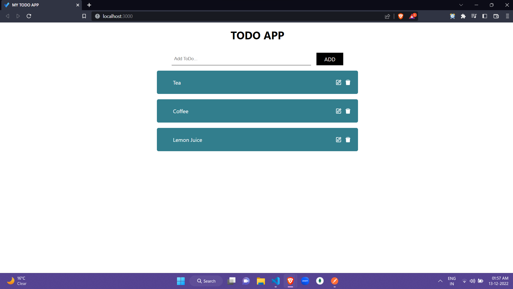

## MERN STACK TODO APP

## Features

- Add a new ToDo
- Update ToDo
- Delete ToDo
- Get all the ToDo

## Tech-Stack used

- MongoDB
- ExpressJS
- React
- NodejS

## Usage guide

- git clone https://github.com/Rohit-Singh-Repos/MERN-APP.git
- cd backend
- npm install
- add PORT and MONGODB_URL in .env file
- node index.js
- cd ../
- cd frontend
- npm install
- npm start

## To checkout the frontend and bcakend separately

- ### [Todo-App-Frontend](https://github.com/abhijitnr/Todo-App-Frontend)
- ### [Todo-App-Backend](https://github.com/abhijitnr/Todo-App-Backend)

## Overview ( Desktop View)

